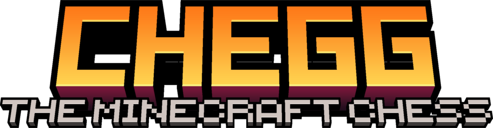

# CHEGG

**Original CHEGG concept by Gerg.** This is an unofficial browser adaptation of the Minecraft minigame from [_The Most COMPLEX Minigame I've Ever Made - CHEGG_](https://www.youtube.com/watch?v=ciZCvS2PKNA).

Play here: https://lfzinho.github.io/minechegg/

CHEGG is a browser tactics game about chess-like creature movement, Minecraft mobs, mana, and deck-built spawn eggs.

Rules:
- Original rules doc: https://docs.google.com/document/d/1TM736HhNsh2nz8l3L-a6PuWAVxbnBSF__NB7qX7Wdlw/edit?tab=t.0
- Local PDF copy: [CHEGG - Official Rules - How to Play.pdf](CHEGG%20-%20Official%20Rules%20-%20How%20to%20Play.pdf)

## Modes

- **Hot-seat:** two players share one computer and pass the screen between turns.
- **Correspondence:** players exchange opaque CHEGG codes manually, with matches saved in the browser through `localStorage`.

## Development

This is a static site. To run it locally:

```bash
python -m http.server 4173
```

Then open `http://localhost:4173/`.
